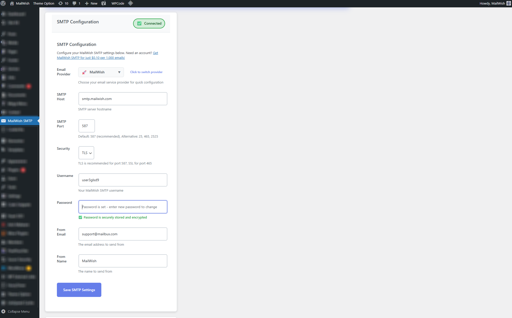
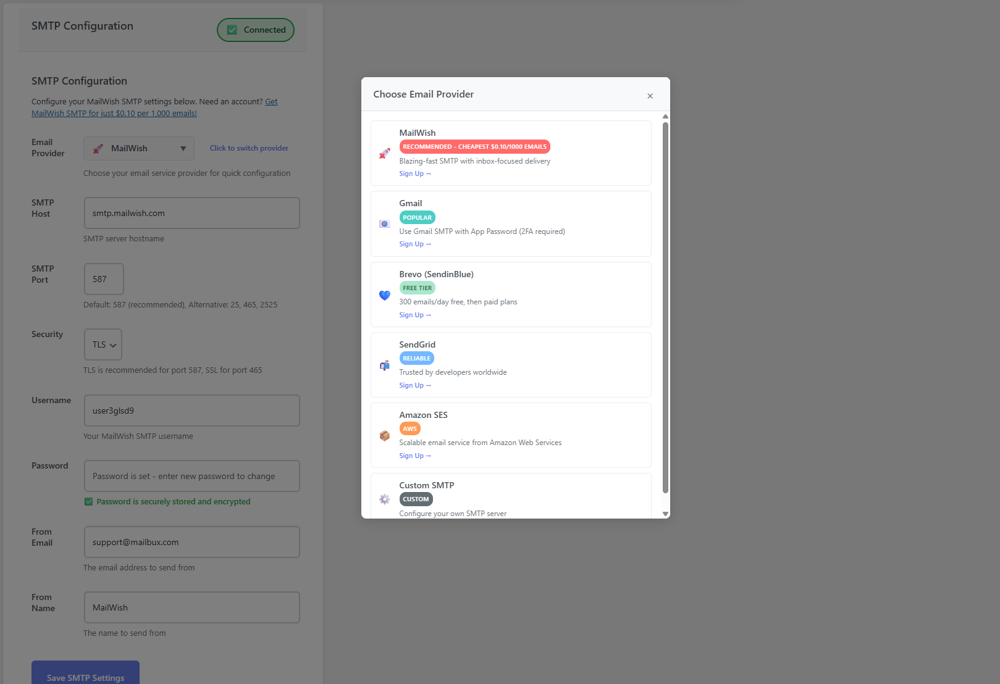

# MailWish SMTP

💸 **Just $0.10 per 1,000 Emails – MailWish SMTP is a Game Changer!** 🚀📩




## Description

🔥 Stop overpaying for email delivery! With MailWish, you get:
- ✅ Blazing-fast SMTP performance
- ✅ Inbox-focused delivery
- ✅ No monthly minimums – pay as you go
- ✅ Perfect for transactional & bulk emails
- ✅ Set up in minutes, scale in seconds

Why pay more when you can send more for less?

## Author

**MailWish** - Professional SMTP Email Delivery Service
- Website: [https://mailwish.com](https://mailwish.com)
- Support: Available through MailWish platform

## Installation

### Method 1: WordPress Admin Dashboard
1. Download the plugin ZIP file
2. Log in to your WordPress admin dashboard
3. Navigate to **Plugins > Add New**
4. Click **Upload Plugin**
5. Choose the downloaded ZIP file and click **Install Now**
6. Click **Activate Plugin**

### Method 2: FTP Upload
1. Extract the plugin files
2. Upload the `wp-mailwish` folder to `/wp-content/plugins/`.
3. Activate the plugin through the **Plugins** menu in WordPress

## Configuration

### Step 1: Get Your MailWish SMTP Credentials

🌐 **Purchase MailWish SMTP Service:**
- Visit [https://mailwish.com](https://mailwish.com)
- Sign up for an account
- Purchase SMTP credits (starting at just $0.10 per 1,000 emails!)
- Get your SMTP username and password from your MailWish dashboard

### Step 2: Configure the Plugin

1. Go to **Settings > MailWish SMTP** in your WordPress admin
2. Enter your MailWish SMTP credentials:
   - **SMTP Host:** `smtp.mailwish.com` (pre-filled)
   - **SMTP Port:** `587` (recommended, pre-filled)
   - **Security:** `TLS` (recommended, pre-filled)
   - **Username:** Your MailWish SMTP username
   - **Password:** Your MailWish SMTP password
   - **From Email:** Your verified sender email address
   - **From Name:** Your preferred sender name

3. Click **Save Changes**

### Step 3: Test Your Configuration

1. Scroll down to the **Test Email** section
2. Enter a test email address
3. Click **Send Test Email**
4. Check if the email was delivered successfully

## SMTP Settings

### Default Configuration
- **Host:** smtp.mailwish.com
- **Port:** 587 (recommended)
- **Security:** TLS
- **Authentication:** Required

### Alternative Ports
- **Port 25:** Standard SMTP (may be blocked by some hosts)
- **Port 465:** SSL/SMTPS
- **Port 2525:** Alternative port (if 587 is blocked)

### Security Options
- **TLS:** Recommended for port 587
- **SSL:** Use with port 465
- **None:** Not recommended for production

## Features

### Automatic Configuration
- Pre-configured with MailWish SMTP settings
- Automatic port/security detection
- Smart defaults for optimal delivery

### Admin Interface
- Easy-to-use settings page
- Built-in test email functionality
- Real-time configuration validation
- Direct links to purchase SMTP service

### WordPress Integration
- Seamless integration with WordPress mail system
- Compatible with all WordPress themes and plugins
- Supports HTML and plain text emails
- Debug mode for troubleshooting

## Troubleshooting

### Common Issues

**1. Test email not sending:**
- Verify your MailWish SMTP credentials
- Check that your hosting provider allows outbound SMTP connections
- Try alternative ports (465, 2525) if 587 is blocked

**2. Authentication failed:**
- Double-check your username and password
- Ensure your MailWish account is active and has credits
- Verify your sender email is authorized in MailWish

**3. Connection timeout:**
- Contact your hosting provider about SMTP restrictions
- Try using port 465 with SSL instead of 587 with TLS

### Debug Mode
Enable WordPress debug mode by adding this to your `wp-config.php`:
```php
define('WP_DEBUG', true);
define('WP_DEBUG_LOG', true);
```

## Why Choose MailWish SMTP?

### Cost-Effective
- **$0.10 per 1,000 emails** - Industry's most competitive pricing
- **No monthly fees** - Pay only for what you use
- **No setup costs** - Start sending immediately

### Performance
- **99.9% uptime** guarantee
- **Global infrastructure** for fast delivery
- **Advanced routing** for optimal inbox placement

### Features
- **Real-time analytics** and delivery tracking
- **Bounce and complaint handling**
- **API access** for advanced integrations
- **24/7 support** from email experts

### Perfect For
- **WordPress websites** and blogs
- **WooCommerce stores** (order confirmations, receipts)
- **Contact forms** and newsletters
- **User notifications** and alerts
- **Transactional emails** of all types

## Getting Started with MailWish

1. **Sign Up:** Visit [https://mailwish.com](https://mailwish.com)
2. **Verify Domain:** Add and verify your sending domain
3. **Purchase Credits:** Buy email credits starting at $0.10/1K
4. **Get Credentials:** Copy your SMTP username and password
5. **Configure Plugin:** Enter credentials in WordPress settings
6. **Start Sending:** Your emails will now use MailWish SMTP!

## Support

### Plugin Support
For WordPress plugin-specific issues:
- Check the troubleshooting section above
- Review WordPress debug logs
- Ensure plugin is up to date

### MailWish SMTP Support
For SMTP service and account issues:
- Log in to your MailWish dashboard
- Contact MailWish support team
- Visit [https://mailwish.com](https://mailwish.com) for documentation

## Requirements

- WordPress 4.6 or higher
- PHP 7.0 or higher
- Active MailWish SMTP account
- Outbound SMTP connections allowed by hosting provider

## License

This plugin is licensed under the GPLv2 or later.

## Changelog

### Version 1.0.0
- Initial release
- Full MailWish SMTP integration
- Admin settings interface
- Test email functionality
- Automatic port/security detection
- WordPress mail system integration

---

**Ready to revolutionize your email delivery?**

🌐 **Get MailWish SMTP Now:** [https://mailwish.com](https://mailwish.com)

*#MailWish #EmailMarketing #SMTP #BulkEmail #TransactionalEmail #EmailDelivery #WordPress #EmailForLess*
